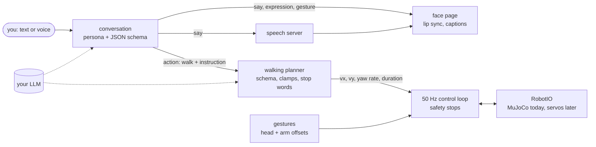

# humanoid-companion

[](https://github.com/YauhenBichel/humanoid-companion/actions/workflows/tests.yml)
[](LICENSE)


A small humanoid robot you can talk to. It **walks** with a reinforcement-learned policy, **waves,
nods and dances** while it talks, shows a **face** with lip sync, and **speaks** — and its brain is a
language model **you run yourself** (Ollama, llama.cpp, vLLM, or any OpenAI-compatible API).

Today its body is a simulated ROBOTIS OP3 in MuJoCo, driven by exactly the control loop a real
robot would run. The goal is to put the same code on a real 50 cm robot.


▶ **[Watch with sound](https://github.com/YauhenBichel/humanoid-companion/blob/main/docs/media/demo-with-sound.mp4)** (35 s). Left: the robot's face. Right: its body, in real time.

| # | Person | Robot says | Face · gesture | Body |
|---|---|---|---|---|
| 1 | Hi! I'm back. | "Hi! Welcome back — I missed you!" | happy · wave | waves, standing |
| 2 | Can you dance for me? | "Absolutely! Let me show you my best dance moves." | happy · dance | dances, then walks the plan it made: 0.79 m and 136° |
| 3 | Please walk forward a little and then turn left. | "On it!" | happy | **0.61 m forward, 82° left** |
| 4 | You did amazing today! | "Thank you! That means so much to me!" | happy · celebrate | both arms up |
| 5 | *(goodbye)* | «Дзякуй, Яўген! Да сустрэчы!» | happy · wave | waves goodbye in a native Belarusian voice |

Every reply was generated live by a local model; no safety stops. The robot never says "owner":
give it your name and it uses it.

## What is inside

| | |
|---|---|
| **Walking** | A PPO policy trained in MuJoCo Playground (MJX) and exported to plain NumPy (matches Brax within 1e-5). A 50 Hz control loop runs it with safety stops: tilt, joint limits, a deadline watchdog, emergency stop. Bundled: `policies/op3_walk.npz` (300 KB). |
| **Brain** | Plain language in, velocity commands out. The model answers in a JSON schema; its answer is never trusted: parsed, validated, clamped to the trained command ranges and a speed cap. Stop words never reach the model. Any failure means "stand still". |
| **Conversation** | A warm, cheerful persona. Each reply is `{say, expression, gesture, action}`, validated before use. The model can only *ask* to walk; the walking planner decides. |
| **Face** | A web page (7 expressions, lip sync from the voice with Web Audio, captions) and a Python renderer of the same face for videos. The page also shows the body's camera live. |
| **Gestures** | Wave, nod, celebrate, look around, dance: head and arm offsets layered over the walking policy, legs left to the policy for balance. Each one measured for stability before it was allowed. |
| **Voice** | Speech and transcription over the OpenAI audio API (Kokoro, Whisper). A Belarusian goodbye in a native voice through [belarusian-tts](https://github.com/YauhenBichel/belarusian-tts). No speech server: the robot shows captions and still moves. |
| **Training** | `train.py` (Brax PPO, CPU or GPU), a hardened environment (pushes, action latency, encoder offsets, domain randomization), evaluation, export, speed sweep. |


## Quick start

Python 3.12 and [uv](https://docs.astral.sh/uv/). macOS or Linux; no GPU needed to run it.

```bash
git clone https://github.com/YauhenBichel/humanoid-companion && cd humanoid-companion
uv sync --frozen

# 1. Watch it walk (bundled policy, C MuJoCo, 10 s at 0.5 m/s)
uv run humanoid-sim --vx 0.5 --seconds 10 --record walk.mp4
bin/viewer --vx 0.4 --seconds 20          # live 3D viewer on macOS (mjpython)

# 2. Give it a brain: any OpenAI-compatible chat server, e.g. Ollama
ollama pull llama3.1:8b
export HUMANOID_LLM_MODEL=llama3.1:8b     # HUMANOID_LLM_BASE_URL defaults to Ollama, 127.0.0.1:11434/v1
export HUMANOID_USER_NAME=Alex            # optional: it calls you by name

# 3. Talk to it: face and body side by side in your browser; type, it answers, speaks and moves
uv run humanoid-talk --open
```

**A voice (optional).** The robot speaks through any server with the OpenAI speech API. Kokoro is
small and natural:

```bash
docker run -p 8880:8880 ghcr.io/remsky/kokoro-fastapi-cpu    # HUMANOID_TTS_BASE_URL defaults to 127.0.0.1:8880/v1
```

For speaking to it (`humanoid-talk --mic`, needs `uv sync --extra voice`), run a Whisper server with
the OpenAI transcription API, e.g. [Speaches](https://github.com/speaches-ai/speaches) on port 8000.
For the native Belarusian goodbye, run [belarusian-tts](https://github.com/YauhenBichel/belarusian-tts)
(port 11810) and set `HUMANOID_USER_NAME_BE` to your name in Belarusian (e.g. `Яўген`).

**Record a conversation** as a split-screen video with sound:

```bash
uv run humanoid-talk --text "Hi! I'm back." --text "Can you dance for me?" \
    --text "Please walk forward a little and then turn left." --record demo/
```

## Teammates


▶ **[Byte explains a queue, with sound](https://github.com/YauhenBichel/humanoid-companion/blob/main/docs/media/byte-explains-a-queue.mp4)** (8 s)


The companion also comes as four characters, on your laptop and in video clips:

| Teammate | Does | Looks | Voice (chat) |
|---|---|---|---|
| **Byte** | explains computer science: algorithms, data structures, complexity, one idea at a time | robot: green face, antenna | Kokoro `af_heart` |
| **Tempo** | sings songs you give it and dances to them | robot: pink face, headphones | Kokoro `af_bella` |
| **Alesia** (Алеся) | a young Belarusian singer: sings songs you give her into a wireless microphone and dances | animated: ash-blonde high bun, silver headphones, electric-blue cropped puffer ([design sheet](docs/media/alesia-design.png)) | Kokoro `af_sky` |
| **Maks** (Максім) | a young Belarusian singer: sings songs you give him into a wireless microphone and dances | animated: textured fringe, black headphones, leather jacket over a teal hoodie ([design sheet](docs/media/maks-design.png)) | Kokoro `am_michael` |

**Live**, with face and body in the browser:

```bash
uv run humanoid-talk --open --teammate byte                    # ask it how Dijkstra's algorithm works
uv run humanoid-talk --open --teammate tempo --songs my-songs/   # ask it to sing one of your songs
uv run humanoid-talk --open --teammate alesia --songs my-songs/  # or ask Alesia or Maks
```

The singers only sing finished songs from `--songs`, one folder per song: `audio.wav` (any format ffmpeg
reads), `times.json` with the sung lines (`[{"text", "start", "end", "words": [{"word", "start", "end"}]}]`)
and optionally `song.json` with a `title`. They never make up lyrics, and sing only what you give
them. The live page shows each line as it is sung. The voices above are only for chatting: a song
keeps its own audio.

Alesia and Maks are original characters drawn in code (`humanoid_companion.singers`); they are not
based on and do not resemble any real person, and their small rhombus motif, inspired by Belarusian
embroidery, is the only regional detail.

**Clips**: `humanoid-perform` turns speech or a song into a video of the character, with the audio:

```bash
uv run humanoid-perform --teammate byte --audio narration.wav --out byte.mov          # ProRes 4444, transparent
uv run humanoid-perform --teammate tempo --audio song/audio.wav --words song/times.json --out tempo.webm   # VP9, transparent
uv run humanoid-perform --teammate tempo --audio song/audio.wav --words song/times.json \
    --background "#101018" --size 1080x1920 --out tempo-vertical.mp4                   # ready to watch
uv run humanoid-perform --teammate alesia --audio song/audio.wav --words song/times.json \
    --bpm 124 --size 360x480 --out alesia.webm                                          # a corner of a vertical video
```

`.mov` and `.webm` keep a transparent background, for laying the character over your own video (for
example `ffmpeg -i clip.mp4 -c:v libvpx-vp9 -i tempo.webm -filter_complex overlay=40:900 out.mp4`).
The mouth follows the voice. For a song, `--words` opens it only while a word is sung: the music
alone doesn't move it, and Alesia's and Maks's mouths also take the shape of the vowel being sung (а/я
open, э/е/і/ы wide, о/у/ё/ю round). The singers dance on the beat (`--bpm`, or estimated from the
audio); Alesia and Maks hold the microphone below and beside the mouth while they sing and lower it
in the pauses. At about 300-360 px wide they suit the corner of a 1080x1920 video. `--cues` sets
expressions over time: `[{"at": 0, "expression": "thinking"}, {"at": 3.5, "expression": "happy"}]`.
If you post these clips, label the voice as AI-generated where the platform asks.

## Configuration

| Variable | Default | What |
|---|---|---|
| `HUMANOID_LLM_BASE_URL` | `http://127.0.0.1:11434/v1` (Ollama) | chat completions with JSON-schema answers |
| `HUMANOID_LLM_MODEL` | *(none; Ollama needs one)* | the model name |
| `HUMANOID_LLM_API_KEY` | *(none)* | sent as a bearer token, for hosted APIs |
| `HUMANOID_TTS_BASE_URL` | `http://127.0.0.1:8880/v1` (Kokoro-FastAPI) | `/audio/speech` |
| `HUMANOID_TTS_VOICE` | `af_heart` | a Kokoro voice |
| `HUMANOID_STT_BASE_URL` | `http://127.0.0.1:8000/v1` (Speaches) | `/audio/transcriptions` |
| `HUMANOID_BE_TTS_URL` | `http://127.0.0.1:11810/v1` ([belarusian-tts](https://github.com/YauhenBichel/belarusian-tts)) | the Belarusian goodbye |
| `HUMANOID_USER_NAME`, `HUMANOID_USER_NAME_BE` | *(none)* | your name, and its Belarusian form for the goodbye |

## How it works



One turn: the face shows *thinking*; the model replies; the speech and the walking plan are fetched
at the same time; then the robot speaks *while* its body acts. Arm gestures come before a walk,
never during it (measured: both arms up tips it over while walking).

The deployment path is written for a real robot: `RobotIO` is the only thing that knows about
MuJoCo. The observation builder reproduces Playground's exactly (including its one-step action
memory and sensor timing), which the parity tests pin.

## Results (simulation)

**Walking**, bundled policy, 10 s at a commanded 0.5 m/s in C MuJoCo (not the MJX it was trained
in, so this is also a sim-to-sim test): **5.27 m** (0.53 m/s), 0.35 m sideways drift, no safety
stop in 500 control steps. In training's own evaluation (128 episodes in MJX): mean 0.519 m/s,
0 falls.

**Speed range** ([docs/speed-sweep.md](docs/speed-sweep.md)): walks at **0.3–0.8 m/s** forward
(top ~0.65 m/s) and backwards at 0.3 m/s. Commands of 0.2 m/s and below make it stand still — a
dead zone from Playground's reward shaping
([mujoco_playground#361](https://github.com/google-deepmind/mujoco_playground/issues/361)) — so the
planner raises slow commands to the slowest real walk.

**Gestures** ([docs/gesture-stability.md](docs/gesture-stability.md)): all five pass standing; nod
and look-around also pass while walking. A raised arm alone tipped the robot over until the other
arm counter-balanced.

**Training**: 103 M environment steps in 96 minutes on a 16-core CPU (AMD Ryzen AI MAX+ 395, JAX
split into 16 CPU devices: 2.8× faster than one). It also runs on that chip's GPU —
see [strix-halo-jax](https://github.com/YauhenBichel/strix-halo-jax).

## Train your own

```bash
uv run python -m humanoid_companion.train --name baseline --cpu-devices 16 --num-envs 4096 --num-timesteps 100000000
uv run python -m humanoid_companion.evaluate --run runs/baseline --no-video
uv run python -m humanoid_companion.export --run runs/baseline          # -> exports/baseline/policy.npz
uv run python -m humanoid_companion.speed_sweep --policy exports/baseline/policy.npz --name baseline
uv run humanoid-talk --open --policy exports/baseline/policy.npz --speed-sweep speed-sweep-baseline.json
```

`--randomize` trains the hardened environment (pushes, latency, encoder offsets, randomized
friction, masses and gains) meant for a real robot.

## Roadmap

1. Hardened policy (domain randomization) and its sim-to-sim numbers.
2. `DynamixelRobotIO`: the real servos and IMU, after a system identification.
3. A real OP3-class robot walking with this code; the face on a small screen on its head.
4. Seeing: a camera, and the model told what is in front of it.

Ideas and pull requests are welcome: [CONTRIBUTING.md](CONTRIBUTING.md).

## Contributors

<!-- readme: contributors,bots/- -start -->
<p align="center">
  <a href="https://github.com/YauhenBichel" title="Yauhen Bichel" aria-label="Yauhen Bichel"></a>
</p>
<!-- readme: contributors,bots/- -end -->

## Licence and disclaimer

Apache-2.0 ([LICENSE](LICENSE), [NOTICE](NOTICE)). The OP3 model and the Op3Joystick environment
come from [MuJoCo Playground](https://github.com/google-deepmind/mujoco_playground) (Apache-2.0).
Not affiliated with ROBOTIS or Google DeepMind.

This is research software for a simulated robot, provided as is. It is not a safety-rated robot
controller: a real robot running it can fall, pinch or hit, so keep people clear and a hand on the
power switch. It is not a medical or care device and must not be used as one.
